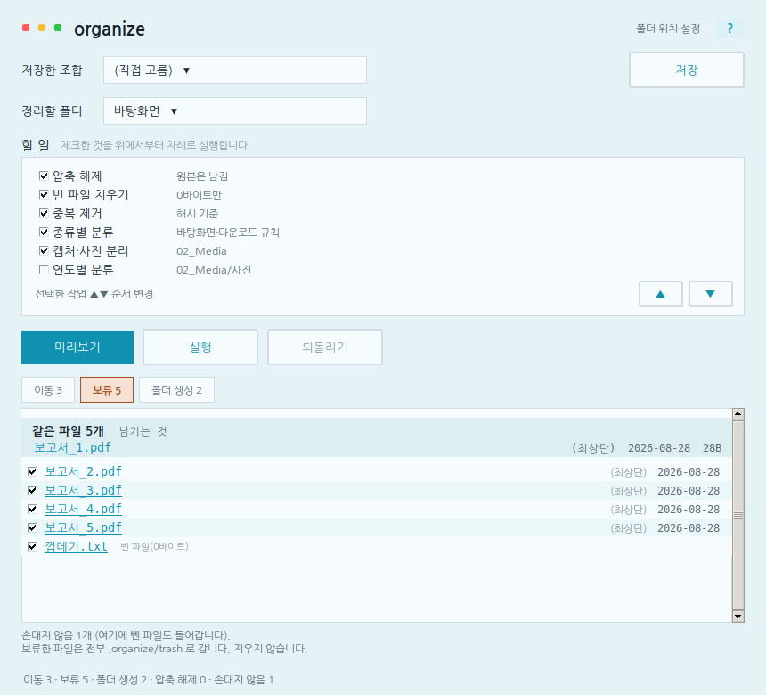
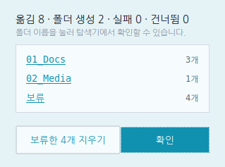
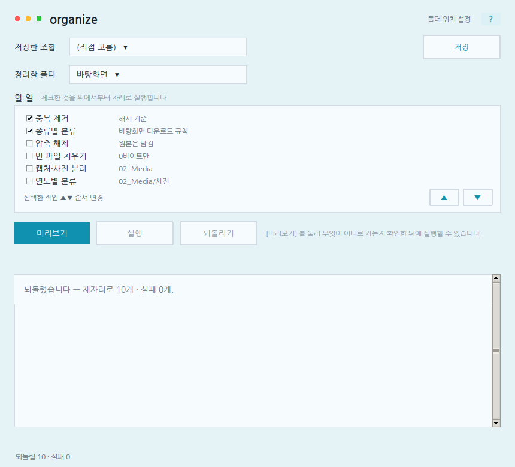
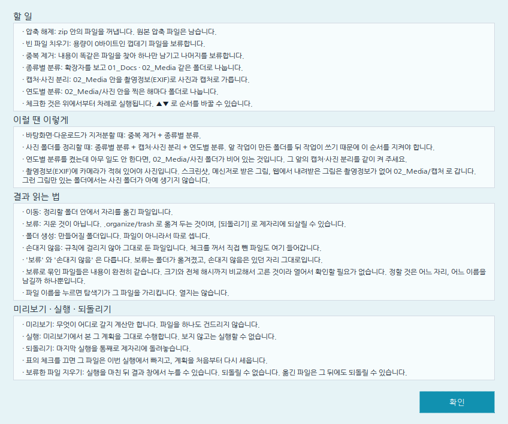

# 처음 설치하기 (Windows 기준)

**컴퓨터 프로그램을 처음 설치해 보는 사람**도 따라 할 수 있게 쓴 안내서다.
git 도, 파이썬(Python — 이 프로그램이 그 위에서 돌아가는 실행기)도 다뤄 본 적
없어도 된다. 순서대로만 따라오면 된다.

더 자세한 기능·명령어는 [README.md](README.md) 를 본다. 이 문서는 "일단 켜서
써보기"까지만 다룬다.

## 이 프로그램이 하는 일

바탕화면·다운로드 폴더가 파일로 지저분할 때, 몇 가지 규칙(중복 파일 치우기 ·
빈 파일 치우기 · 종류별로 폴더 나누기 등)을 골라서 자동으로 정리해 주는
프로그램이다. **항상 미리보기부터 보여주고, 실행해도 되돌릴 수 있다** — 잘못
눌러도 파일이 사라지지 않는다.

## 1단계 — 파이썬(Python) 이 있는지 확인

1. 시작 메뉴에서 `PowerShell` 을 검색해 실행한다. (글자를 치고 Enter 를 누르면
   명령이 실행되는 검은/파란 창이 하나 뜬다 — 이런 창을 **터미널**이라 부른다.)
2. 아래를 치고 Enter:
   ```
   python --version
   ```
3. `Python 3.11` 이상 숫자가 나오면 이미 있는 것이다 → **2단계**로 건너뛴다.
   `'python' 은(는) 내부 또는 외부 명령... 이 아닙니다` 같은 에러가 나오면
   없는 것이다 → 아래 순서대로 설치한다.

### 파이썬 설치하기 (없을 때만)

1. https://www.python.org/downloads/ 접속 → 화면 위쪽의 노란 `Download Python
   3.x.x` 버튼 클릭.
2. 받은 설치 파일을 실행한다.
3. **가장 중요한 단계**: 설치 화면 맨 아래에 있는 `Add python.exe to PATH`
   (또는 `Add Python to PATH`) 체크박스를 **반드시 체크**한다. PATH 는 "터미널
   이 `python` 이라는 명령을 어디서 찾을지 아는 목록"이다 — 이 체크를 빼먹는
   것이 이 프로그램을 못 켜는 **가장 흔한 원인**이다.
4. `Install Now` 클릭 → 설치가 끝나면 **PowerShell 창을 닫았다가 다시 연다**
   (방금 바뀐 설정은 새로 여는 창부터 적용된다).
5. 다시 `python --version` 을 쳐서 숫자가 나오는지 확인한다.

## 2단계 — 프로그램 받기

git 을 몰라도 된다. 웹 페이지에서 그냥 내려받으면 된다.

1. https://github.com/daxjective/organize 접속.
2. 초록색 `Code` 버튼 클릭 → `Download ZIP` 클릭.
3. 받은 `organize-main.zip` 파일을 원하는 위치에서 **압축을 푼다**(파일 우클릭
   → `압축 풀기` 또는 `모두 추출`).
4. 압축 푼 폴더(예: `organize-main`) 를 앞으로 **"그 폴더"**라고 부른다. 그
   폴더를 열어 보면 안에 또 `organize` 라는 폴더(코드가 든 곳)가 보여야 한다.

> git 을 다룰 줄 안다면 이 대신 터미널에서 이렇게 받아도 된다:
> ```
> git clone https://github.com/daxjective/organize.git
> ```

## 3단계 — 실행하기

1. PowerShell 을 연다(1단계에서 한 것처럼).
2. 방금 받은 **그 폴더**로 이동한다. 예를 들어 다운로드 폴더에 풀었다면:
   ```
   cd 다운로드\organize-main
   ```
   (또는 탐색기에서 그 폴더를 연 채로 주소창을 클릭해 경로를 복사한 뒤,
   `cd "복사한 경로"` 로 붙여넣어도 된다.)
3. **사진 정리 기능(촬영일로 나누기)을 쓸 거라면** 아래도 미리 쳐 둔다 — 지금 안
   해두면 나중에 사진이 아무 폴더로도 안 넘어가는데 **에러 메시지 하나 없이** 그러고
   있어서 당황하기 쉽다:
   ```
   pip install Pillow
   ```
4. 아래를 친다:
   ```
   python -m organize doctor
   ```
   부족한 것이 있으면 알려준다. `Pillow` 줄이 "있음"으로 나오는지 확인한다(방금
   3번을 건너뛰었다면 "없음"이 정상이다 — 사진 정리를 안 쓸 거라면 그냥 둬도 된다).
5. 창으로 실행한다:
   ```
   python -m organize gui
   ```
   프로그램 창이 뜬다.

### 흔한 오류

| 메시지 | 원인 | 해결 |
|---|---|---|
| `'python' 은(는) 내부 또는 외부 명령... 이 아닙니다` | 파이썬이 없거나, 설치할 때 PATH 체크를 안 함 | 1단계를 다시 밟는다. `Add python.exe to PATH` 를 꼭 체크한다 |
| `No module named organize` | 지금 있는 폴더 위치가 틀림 | `cd` 로 옮겨 간 폴더 **안에** `organize` 폴더가 보이는지 확인한다(2단계-4) |
| 창이 안 뜨고 tkinter 관련 글자가 보임 | (드묾) 파이썬 설치 시 일부 구성요소를 뺌 | 파이썬을 기본 옵션 그대로 다시 설치한다 |
| 사진이 「캡처·사진 분리」·「연도별 분류」에서 계속 안 넘어감(에러도 안 뜨고 조용히 아무 일도 안 함) | 3단계-3 을 건너뛰어서 `Pillow` 가 안 깔림 | `pip install Pillow` 실행 → `python -m organize doctor` 로 "Pillow 있음" 확인 |
| 사진 파일명의 연도를 바꿔도 그 연도 폴더로 안 감 | 정상 동작이다 — 파일명보다 **사진 안의 촬영정보(EXIF)** 를 우선한다 | 진짜 촬영일을 보려면 그 사진 속성 → "찍은 날짜" 확인 |

## 4단계 — 처음 써보기

1. 창 위쪽 **정리할 폴더**에서 정리하고 싶은 폴더를 고른다(바탕화면·다운로드
   등은 자동으로 목록에 뜬다).
2. **할 일**에서 하고 싶은 것만 체크한다(몇 개는 기본으로 켜져 있다).
3. **[미리보기]** 를 누른다 — **이 단계는 파일을 하나도 건드리지 않는다.**
   무엇이 어디로 어떻게 바뀔지 표로만 보여준다. 아래 「보류」 탭처럼, 내용이
   같은 파일은 무리로 묶어서 **남기는 파일**을 보여준다.

   

4. 결과가 마음에 들면 **[실행]** 을 누른다. 창이 하나 더 뜨며 무엇이 몇 개
   옮겨졌는지 보여준다.

   

   마음에 안 들면 체크를 바꾸고 다시 미리보기를 누르면 된다(아직 아무것도
   실행하지 않았다면 아무 흔적도 남지 않는다).
5. 실행한 뒤 마음이 바뀌면 **[되돌리기]** 로 방금 한 정리를 그대로 되돌릴 수
   있다.

   

6. 막히면 창 오른쪽 위 **[?]** 를 누른다. 할 일 하나하나와 결과 읽는 법을
   설명해 준다.

   

**지워진 것처럼 보이는 파일도 실제로는 지워지지 않는다** — `.organize/trash`
라는 숨김 폴더로 옮겨 둔 것뿐이고, [되돌리기]를 누르면 제자리로 돌아온다.

## 더 알고 싶다면

- 전체 기능·명령줄 사용법: [README.md](README.md)
- 아직 실제 윈도우에서 확인 못 한 부분: README 의 "현재 상태" 항목 참고
